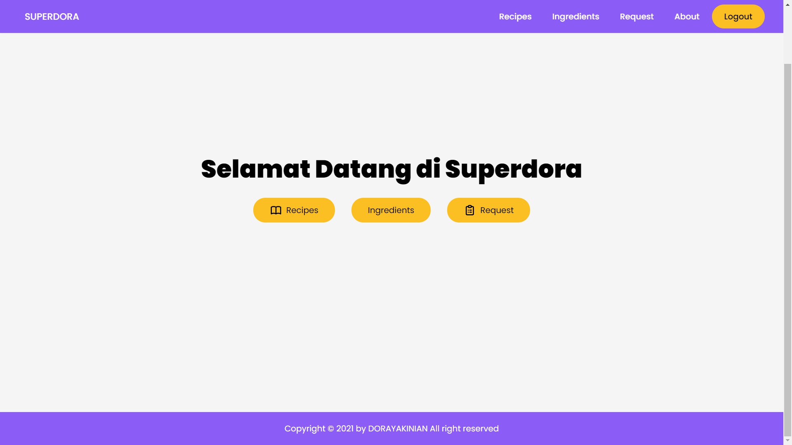
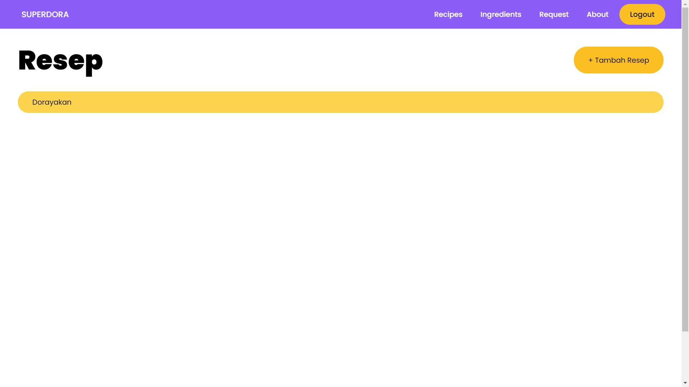
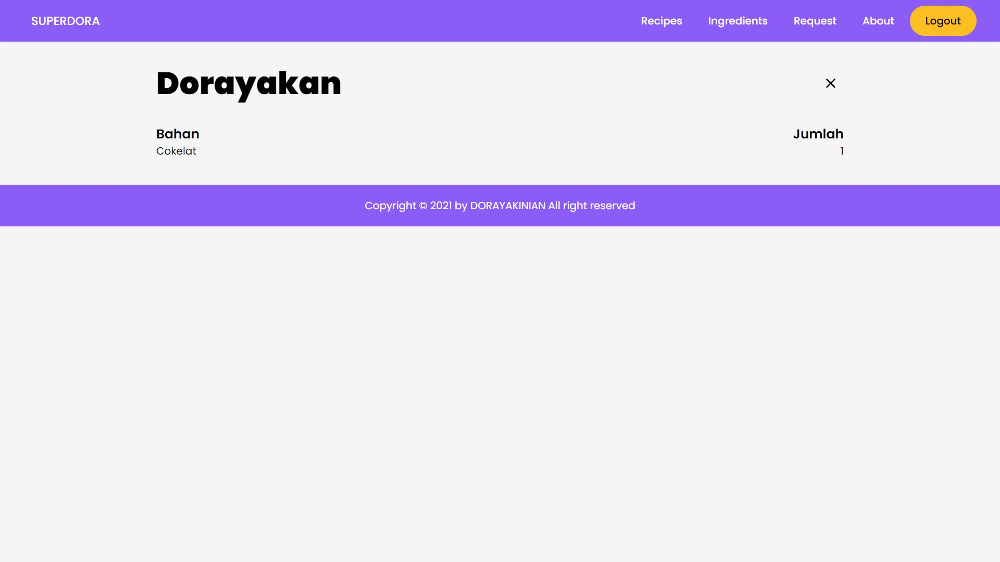
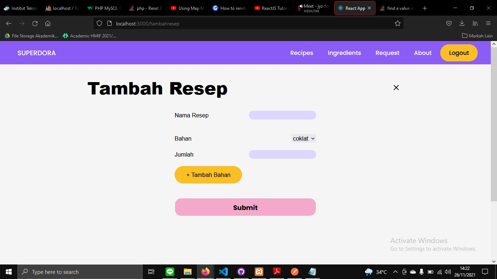
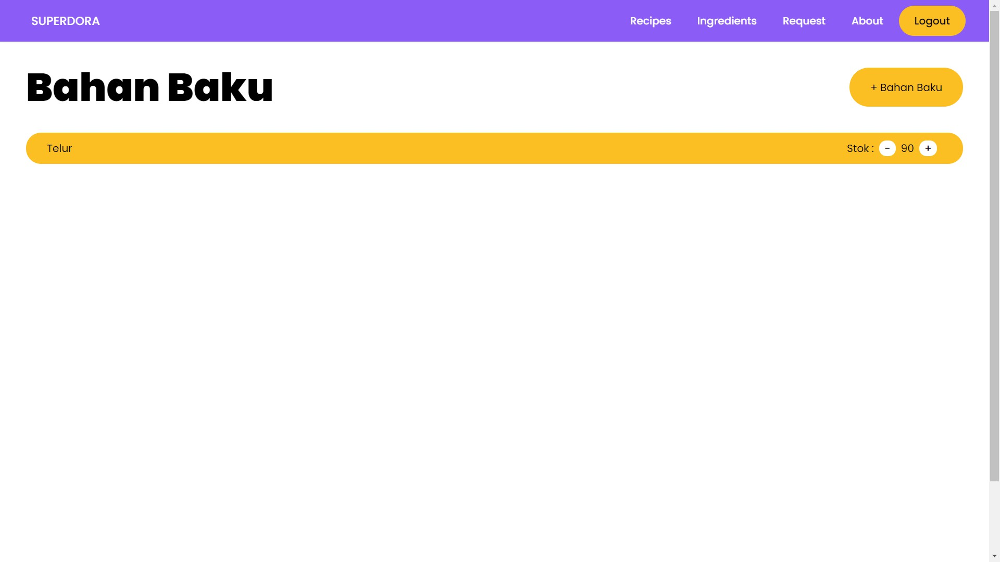
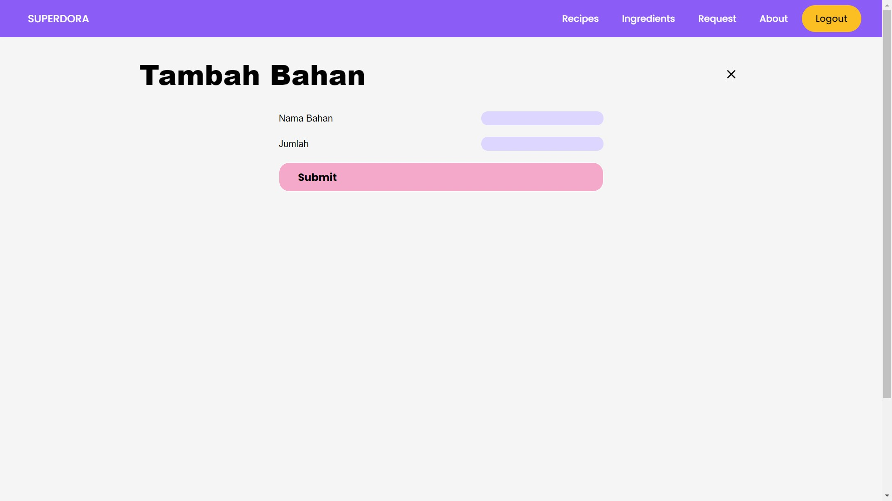
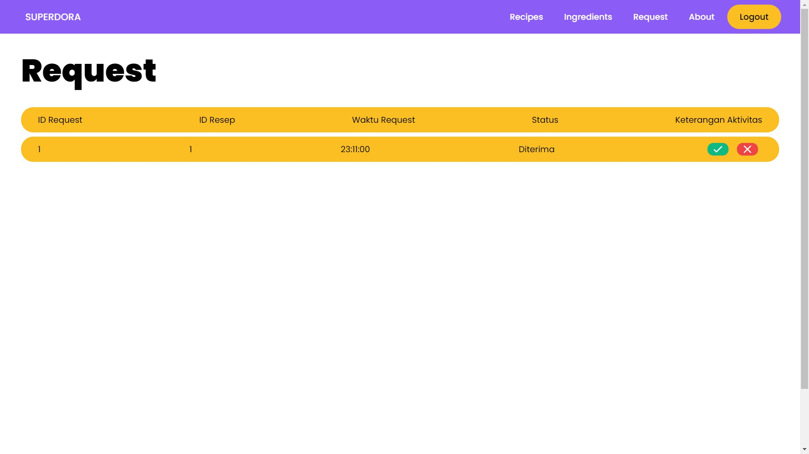
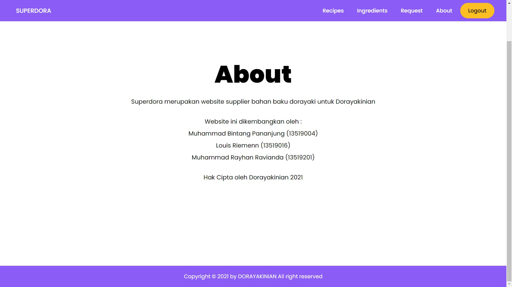

# Dorayaki Factory - Client Side
## Deskripsi

Website ini dibuat dalam rangka menyelesaikan Tugas Besar 2 dari mata kuliah IF3110 Pengembangan Aplikasi Berbasis Web semester 1 tahun ajaran 2021/2022. Website ini merupakan situs untuk penyuplai bahan dorayaki berbagai macam rasa kepada toko dorayaki Dorayakinian. Website ini ditulis menggunakan dengan NODE JS untuk Front-End, REST untuk Back-End, dan SQL untuk Database.

## Screenshot Website









## Tentang Pembuat

Program ini dibuat oleh Muhammad Bintang Pananjung (NIM 13519004), Louis Riemann (NIM 13519016) dan Muhammad Rayhan Ravianda (NIM 13519201), tiga mahasiswa program studi Teknik Informatika angkatan 2019 Institut Teknologi Bandung yang saat ini sedang menjalankan studi di semester 5. Pembagian kerja dan kontribusi dalam kelompok adalah sebagai berikut.
```
NodeJS
Frontend Pabrik Fungsi Login dan Register : 13519016
Frontend Pabrik Fungsi Resep : 13519201
Frontend Pabrik Fungsi Bahan Baku: 13519201
Frontend Pabrik Fungsi Daftar Request: 13519004, 13519201
```
