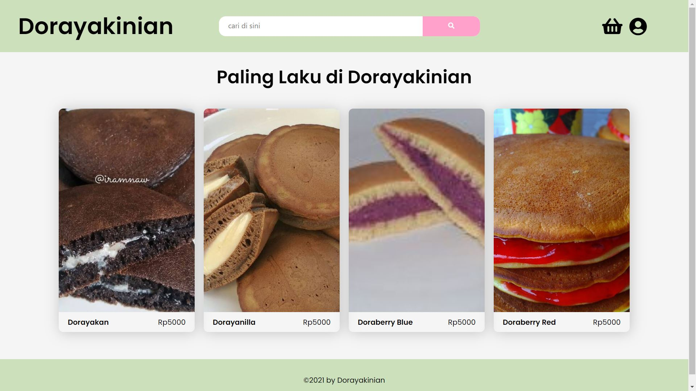

# Dorayakinian - Dorayaki Store
## Deskripsi

Website ini dibuat dalam rangka menyelesaikan Tugas Besar 2 dari mata kuliah IF3110 Pengembangan Aplikasi Berbasis Web semester 1 tahun ajaran 2021/2022. Website ini merupakan situs untuk penjuala dorayaki berbagai macam rasa. Website ini ditulis menggunakan HTML, CSS, dan AJAX untuk Front-End, PHP untuk Back-End, dan SQL untuk Database.

## Requirement Program

Program berjalan dengan baik dengan spesifikasi :
- Windows 10 64-bit
- XAMPP Control Panel v3.3.0

## Cara Instalasi dan Menjalankan Server

Program dapat digunakan dengan cara sebagai berikut :
1. Clone atau download repository ini terlebih dahulu.
2. Lakukan instalasi XAMPP untuk menjalankan localhost server.
3. Pindahkan repository ke dalam folder "htdocs" yang berada di dalam folder penyimpanan XAMPP anda.
4. Buka XAMPP Control Panel dan jalankan modul apache.
5. Buka web browser dan masukkan alamat 'localhost/Dorayakinian/PHP/index.php'.
6. Website siap digunakan.

## Screenshot Website




## Perubahan pada Tubes 2
Pada pengerjaan Tubes 2 tidak dilakukannya perubahan skema basis data. Perubahan hanya dilakukan pada halaman edit stok dorayaki dan pada halaman tambah varian dorayaki.

## Tentang Pembuat

Program ini dibuat oleh Muhammad Bintang Pananjung (NIM 13519004), Louis Riemann (NIM 13519016) dan Muhammad Rayhan Ravianda (NIM 13519201), tiga mahasiswa program studi Teknik Informatika angkatan 2019 Institut Teknologi Bandung yang saat ini sedang menjalankan studi di semester 5. Pembagian kerja dan kontribusi dalam kelompok adalah sebagai berikut.
```
Service Toko
- Perubahan Halaman Edit Stok di Toko  : 13519201
- Perubahan Halaman Create Dorayaki di Toko : 13519004
```

Terima kasih.
